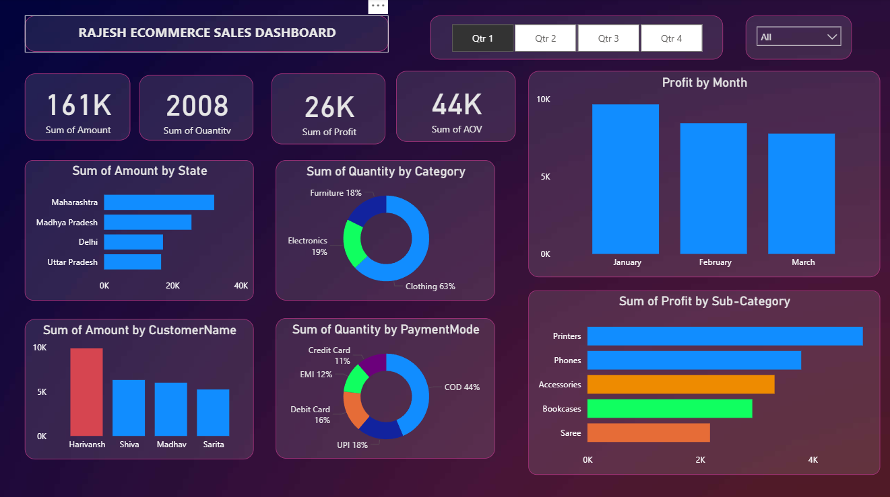

# 📊 Rajesh Store Sales Dashboard (Power BI Project)

## 📌 Project Overview

This project presents an interactive Sales Analytics Dashboard built using Microsoft Power BI.  
The dashboard analyzes sales performance, profit trends, customer segments, and regional insights for Rajesh Store.

The objective of this project is to transform raw transactional data into actionable business insights using data visualization and DAX.

---

## 📸 Dashboard Preview



---

## 🛠 Tools & Technologies Used

- Microsoft Power BI
- Power Query (Data Cleaning & Transformation)
- DAX (Data Analysis Expressions)
- CSV Datasets

---

## 📂 Dataset Information

The project uses two datasets:

- `Orders.csv` – Contains order-level transaction details
- `Details.csv` – Contains product and category information

---

## 📈 Key Insights Generated

- 💰 Total Sales and Profit Analysis
- 📊 Monthly Sales Trend
- 🛍 Category-wise Performance
- 🌍 Region-wise Revenue Distribution
- 🧑‍💼 Customer Segment Analysis
- 📦 Top Performing Products

---

## 📊 Key KPIs Displayed

- Total Revenue
- Total Profit
- Profit Margin
- Total Orders
- Category Contribution %

---

## 🚀 Business Impact

- Identified high-performing categories and regions
- Highlighted low-profit segments for optimization
- Provided data-driven decision-making support

---

## 📂 Repository Structure

```
Rajesh-Store/
│
├── images/
│   └── dashboard.png
├── Orders.csv
├── Details.csv
├── Rajesh_Store.pbix
└── README.md
```

---

## ▶ How to Use

1. Download the `.pbix` file
2. Open using Microsoft Power BI Desktop
3. Refresh dataset if required
4. Explore interactive visualizations

---

## 🎯 Skills Demonstrated

- Data Cleaning & Transformation
- Data Modeling
- DAX Calculations
- Business Intelligence
- Dashboard Design
- Analytical Thinking

---

## 👨‍💻 Author

Rajesh Kumar  
Aspiring Data Analyst | ML Enthusiast | SDE Aspirant
